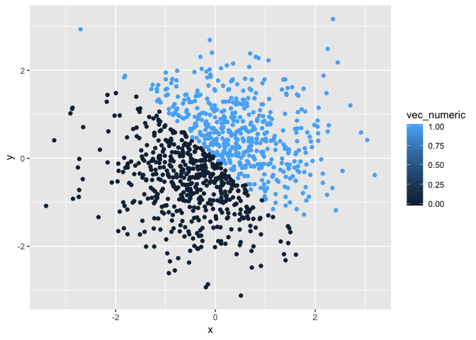
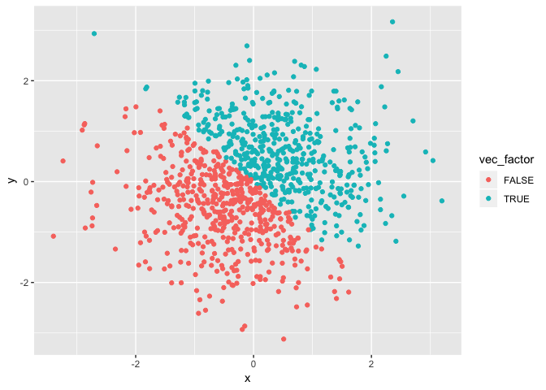

Homework 1
================
Jeanette Shekelle
09/21/18

Loading tidyverse package
-------------------------

``` r
library(tidyverse)
```

    ## ── Attaching packages ─────────────────────────────── tidyverse 1.2.1 ──

    ## ✔ ggplot2 3.0.0     ✔ purrr   0.2.5
    ## ✔ tibble  1.4.2     ✔ dplyr   0.7.6
    ## ✔ tidyr   0.8.1     ✔ stringr 1.3.1
    ## ✔ readr   1.1.1     ✔ forcats 0.3.0

    ## ── Conflicts ────────────────────────────────── tidyverse_conflicts() ──
    ## ✖ dplyr::filter() masks stats::filter()
    ## ✖ dplyr::lag()    masks stats::lag()

Problem 1
---------

Create a data frame comprised of:

-   A random sample of size 10 from a uniform\[0, 5\] distribution.
-   A logical vector indicating whether elements of the sample are greater than 2.
-   A (length-10) character vector.
-   A (length-10) factor vector.

``` r
set.seed(1234)
problem_one_df = tibble(
  vec_numeric = runif(10, 0, 5),
  vec_char = c("elephant", "giraffe", "dog", "cat", "cow", "fish", "kangaroo", "zebra", "monkey", "snake"),
  vec_factor = factor(c("red", "orange", "yellow", "green", "blue", "purple", "pink", "white", "black", "grey")),
  vec_logic = (vec_numeric > 2))
```

Taking the mean of each variable:
---------------------------------

The numeric mean is 2.4461321. The character mean is NA. The factor mean is NA. The logic mean is 0.7.

The charactor and factor means were NA because they are not numeric values. You can't take the mean of non-numeric variables. There is no ordering or numbering or charactors or factors. The logic variable's (true/false) mean is the proportion of trues to falses with trues being represented by 1 and falses being represented by 0. The numeric mean works because it is the mean of the numbers from 0 to 5.

Applying the as.numeric function to the logical, character, and factor variables:
---------------------------------------------------------------------------------

``` r
as.numeric(problem_one_df$vec_char)
as.numeric(problem_one_df$vec_factor)
as.numeric(problem_one_df$vec_logic)
```

The character variable was not converted to a numeric value because there was no pattern or order to turn into numbers. The conversion fails. The factor variable was converted into random numbers 1-10, with all different numbers because each factor is a different color, and the logic vector was converted into 0s for false and 1s for true.

Converting the character variable to a factor variable to a numeric variable:

``` r
as.numeric(as.factor(problem_one_df$vec_char))
```

The character variable is assigned levels when converted to a factor variable. The levels can then be converted to numbers (1-10).

Converting the factor variable to a character variable to a numeric variable:

``` r
as.numeric(as.character(problem_one_df$vec_factor))
```

When the factor variable is converted to a character variable, it is assigned letters. Letters cannot be turned into numbers so the conversion fails. We see a warning message and all the values are turned to NA.

Problem 2
---------

Create a data frame comprised of:

-   x: a random sample of size 1000 from a standard Normal distribution
-   y: a random sample of size 1000 from a standard Normal distribution
-   A logical vector indicating whether the x + y &gt; 0
-   A numeric vector created by coercing the above logical vector
-   A factor vector created by coercing the above logical vector

``` r
problem_two_df = tibble(
  x = rnorm(1000),
  y = rnorm(1000),
  vec_logic = (x + y > 0)
)

problem_two_df$vec_numeric = as.numeric(problem_two_df$vec_logic)
problem_two_df$vec_factor = as.factor(problem_two_df$vec_logic)
```

The size of the dataset is 1000. The mean of x is -0.0259401. The median of x is -0.0397942. The proportion of cases for which the logical vector is TRUE is 0.498

Scatterplot of y vs x with color points using the logical variable:

``` r
ggplot(problem_two_df, aes(x = x, y = y, color = vec_logic)) + geom_point()
```


Scatterplot of y vs x with color points using the numeric variable:

``` r
ggplot(problem_two_df, aes(x = x, y = y, color = vec_numeric)) + geom_point()
```



Scatterplot of y vs x with color points using the factor variable:

``` r
ggplot(problem_two_df, aes(x = x, y = y, color = vec_factor)) + geom_point()
```


